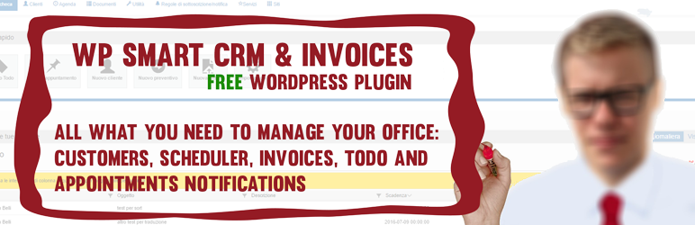

<h2 align="center" style="color:#38c2bb;">📚 PS PopUp</h2>

  <a href="https://github.com/cp-psource/ps-popup/discussions" style="color:#38c2bb;">💬 Forum</a>
  <a href="https://github.com/cp-psource/ps-popup/releases" style="color:#38c2bb;">📝 Download</a>

CP Smart CRM deckt eine Vielzahl von "Büroverwaltungsfunktionen" ab. 

CRM-Verwaltung: 

- Kundenarchiv-Raster
- Benutzerdefinierte Rolle "CRM-Agent
- Terminplaner für Aufgaben und Termine
- Zeitleiste für Notizen
- TODO / Termin Status Update
- Benachrichtigungssystem (E-Mail und Dashboard)
- Benachrichtigung an einzelne Benutzer(innen)
- Benachrichtigung an bestimmte WP-Rolle(n)
- Benutzerdefinierte Benachrichtigungsregeln
- Aufeinanderfolgende Benachrichtigungsschritte (für mittel-/langfristig auslaufende Dienstleistungen)
- Kunden CSV-Import 

Verwaltung von Rechnungen/Angeboten

- Dynamische Erstellung von Rechnungen/Angeboten mit mehrzeiligen Produkten
- Erstellung von Rechnungen/Angeboten im .pdf-Format
- PDF herunterladen und auf dem Server speichern
- Benutzerdefiniertes LOGO
- Benutzerdefinierte Ausrichtung der Kopfelemente in der PDF-Vorlage
- Konfigurierbare Fälligkeitsdaten für Zahlungen
- Benachrichtigung bei Ablauf der Zahlung
- Interne Kommentare und Angeboten
- Benutzerdefinierte Canvas-Signatur im Angebot (Touch-kompatibel)
- Registrierung von Rechnungen
- Benutzerdefinierter Startwert für die Nummerierung (Sie können zu jedem beliebigen Zeitpunkt des Jahres mit einer von 1 abweichenden Startnummer beginnen, in Übereinstimmung mit Ihrer Buchhaltung)

Alle Datensätze in den Rastern sind mit Filter-/Gruppierungs-/Sortierfunktionen für eine schnelle Nutzung ausgestattet.

Alle Informationen in den Rastern sind mit Symbolen/Farben visuell aufgewertet, um immer einen schnellen Überblick zu gewährleisten.

Wenn Sie uns Feedback schicken möchten, benutzen Sie das Support-Forum, wenn Sie an der Übersetzung in weitere Sprachen teilnehmen möchten, schreiben Sie uns eine Nachricht an info [at] smart-cms.smart-cms.n3rds.work/
Wichtig: Wenn Sie .mo/.po-Dateien im Plugin-Ordner "languages" ändern, können Ihre Änderungen beim nächsten Update verloren gehen. Um dies zu verhindern, kopieren Sie Ihre .mo/.po-Dateien in den Ordner "/wp-content/languages/plugins".

